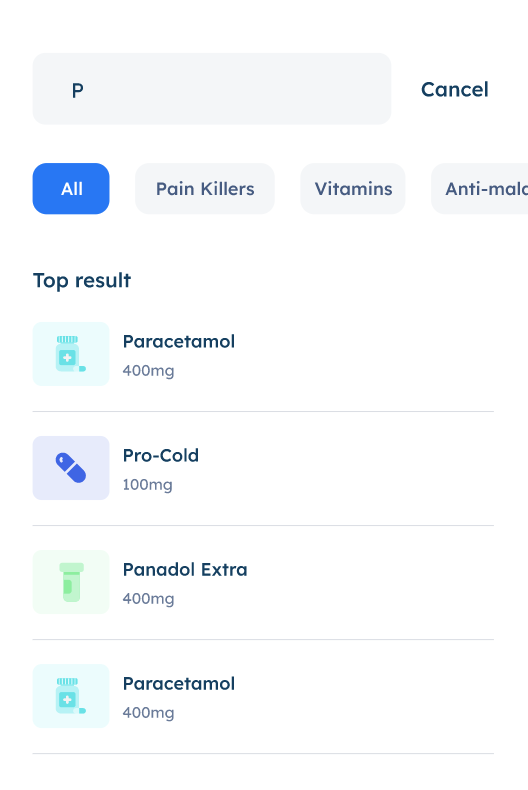

# CraftTurf - Senior Frontend Engineering Test

You are required to complete **as much as you can** of the following tasks below.

**NOTE:** This repository uses [Next.js](https://nextjs.org/docs) as the bootstrapped toolchain.

## Prerequisites

- `"node": ">=12.22.0"`
- Install `yarn` globally

## Task 1: Setup

Setup the repo on your system.

```bash
# Install the node modules
$ yarn
# Start the server
$ yarn dev
```

Open [http://localhost:3000](http://localhost:3000) with your browser to see the result.

You can start editing the page by modifying `pages/index.tsx`. The page auto-updates as you edit the file.

[API routes](https://nextjs.org/docs/api-routes/introduction) can be accessed on [http://localhost:3000/api/hello](http://localhost:3000/api/hello). This endpoint can be edited in `pages/api/hello.ts`.

The `pages/api` directory is mapped to `/api/*`. Files in this directory are treated as [API routes](https://nextjs.org/docs/api-routes/introduction) instead of React pages.

### NOTE
Before you begin the remaining tasks, it is highly recommended that you consider your implementation approach after having read through [Design Considerations](https://github.com/jabdul/pharmacy-interview-ui-test#design-considerations-bonus) section below.


## Task 2: UI Implementation from Prototype

Study the Adobe XD prototype [pharmacy UI](https://xd.adobe.com/view/563b6800-cc1c-434c-b4f6-b405bf7bfaf3-0368/) design.

### Search UI


- Interact with the search field;
- implement the autocomplete design.

### Search Results



- Implement the search results.
- Implement the filtering pills.
- **Cancel** button should trigger automatic navigation back to the search screen.

## Task 3: Integrate with Drug API

Integrate the implemented UI with a RESTful `api/medications` API endpoint.

- Create dummy JSON data using the [Drug Index](https://www.drugs.com/drug_information.html) as source. Properties of the resource should be limited to:
 - `brandName`
- Complete the autocomplete search feature by integrating with the fetched drug data.
 - begin the fetch after entry of two characters only;
 - show **NOT FOUND** for searches without matching results.
- Apply the interaction on the filter pills to match the available drugs in store.


## Task 4: Deploy on Vercel

The easiest way to deploy your Next.js app is to use the [Vercel Platform](https://vercel.com/new?utm_medium=default-template&filter=next.js&utm_source=create-next-app&utm_campaign=create-next-app-readme) from the creators of Next.js.

Check out our [Next.js deployment documentation](https://nextjs.org/docs/deployment) for more details.

## Design Considerations (BONUS)

Your approach to solving the problems in Tasks 2 and 3 is strongly influenced by your earlier choices before the implementation phase. For a scalable solution, incorporate one more of the following options:

1. According to your interpretation of the existing design, implement a responsive layout that is optimised for mobile, tablet, and desktop.

2. Implement the tasks using a combination of the following technologies:
 - [Material-UI](https://material-ui.com/)
 - Redux
 - Unit tests (i.e. jest)


3. Offline storage. Apply to fetched drug data.
